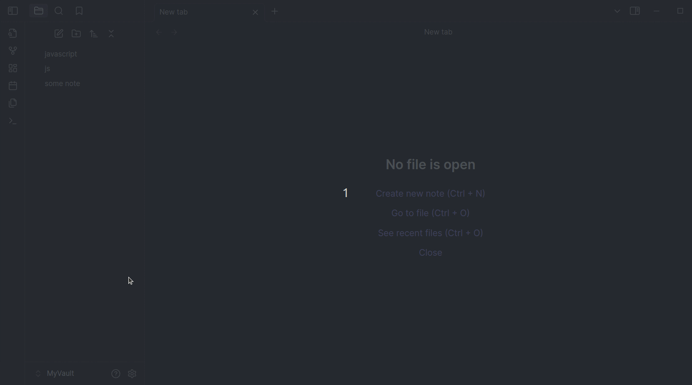

# FastForwardLink

Obsidian lets you link notes. Great.

But real people don't always use the same terms consistently:
- abbreviations
- acronyms
- nicknames
- alternate spellings
- inside jokes

So you might write:
- `javascript`
- `js`
- `ecmascript`

...while meaning the exact same thing.

By default, Obsidian treats these as separate notes.

Over time, that creates:
- duplicate notes
- fragmented knowledge base
- inconsistent linking
- friction while writing naturally

FastForwardLink solves this by turning alias notes into lightweight redirects.

Write naturally. Land on the right note — fast.


## FastForwardLink Plugin Demo



FastForwardLink lets multiple note names point to the same canonical note. Write naturally without fragmenting your vault structure:

- `js` → `javascript`
- `ps` → `photoshop`

## How It Works

Suppose you have a note called `javascript`.

Elsewhere in your vault, you naturally write:

```text
[[js]]
```
Normally, Obsidian would create a brand-new js note. But with FastForwardLink:
- Create a note called `js`
- Add redirect syntax inside it
- Opening `js` automatically forwards to `javascript`

Here are some examples of how you might set up FastForwardLink:

- `ps` > `photoshop`
- `js` > `javascript`
- `tay tay` > `taylor swift`
- `e=mc2` > `Einstein's special theory of relativity`
- `favorite film` > `bill and ted's bogus journey`

## Features

- **Multiple Links, One Target**: Set multiple links to redirect to a single target note for quick navigation between related topics or abbreviations. Organize synonyms or alternate spellings for easier access.

- **Quick-Paste Command**: Set target notes on the fly without breaking your writing flow. In the Obsidian command palette, select **Paste redirect syntax onto selection** to quickly create a forwarding link.

- **Organized Vault**: Streamline vault navigation by unifying concepts, perfect for efficient, clutter-free notes.

- **Easy Management**: Forwarding notes are automatically moved to a designated folder for easy review, management, or removal.

- **Flexible Forwarding Options**:
    - Open the target note in the same tab.
    - Open the target note in a new tab while remaining on the original note.
    - Open the target note in a new tab and switch to it automatically.

- **Remove Forwarding Notes in One Click**: Easily delete all redirecting notes with a single click using plugin settings.

## Installation

Download the plugin directly from Obsidian's community plugins. Just search for FastForwardLink.

You can also install manually by doing the following:

1. [Download the following plugin files](https://github.com/IdanLib/ObsidianFastForwardLinkPlugin):
    - `data.json`
    - `main.js`
    - `manifest.json`

2. Copy these files to your vault's plugins folder at `{VaultFolder}/.obsidian/plugins/FastForwardLink`.
3. In Obsidian, go to **Settings** > **Community Plugins** and enable **FastForwardLink**.

The plugin is now ready for use.

## Create a Fast-Forward Link

To create a fast-forwarding link:

1. Create or open the note you want to fast-forward to a target note. For example, a note titled `ps`.
2. In the note, type the target note's title wrapped in the forwarding syntax: `::>[[target-note]]`. For example, to forward from `ps` to `photoshop`, include `::>[[photoshop]]` in the `ps` note.

Clicking the `ps` link in any note now opens the `photoshop` note.

## Quick-Paste Syntax

Yup, typing sucks. Fortunately, there's a command to help you quickly paste the redirect syntax into your code:

1. Press `Ctrl + P` to open the Obsidian command palette.
2. Search for and select the command **Paste Redirect Syntax onto Selection**.

The command wraps the selected text in the fast-forward syntax.

> [!TIP] > [Add a hotkey](https://help.obsidian.md/User+interface/Hotkeys#Setting+hotkeys) to trigger this command! We recommend `Ctrl + Alt + R` (PC) or `Cmd + Opt + R` (macOS).

## Version Updates

### Version 1.1

Some improvements include:

- You can now temporarily bypass forwarding with a designated command. In Obsidian's command palette, search for "FastForwardLink".
- Source code refactored and better organized for future contributors.
- Better robust event and error handling and messaging.

## Bugs and Contact

Found a bug? Well, we can't have those!

Please open an issue in the [plugin's GitHub repository](https://github.com/IdanLib/ObsidianFastForwardLinkPlugin) or [contact the developer](mailto:idanlib@gmail.com) directly.

### Known Bugs

- When "Open the target note in a new tab" is enabled and the fast-forwarding note has not yet been moved to the `_forwards_` folder, some additional tabs are opened. This is likely due to internal timing issues in the Obsidian-OS interaction.

    When the fast-forwarding note is in the `_forwards` folder, plugin behavior is as expected.

## Supporting this plugin

If you enjoy using FastForwardLink, consider supporting its development by [buying me a coffee](https://www.buymeacoffee.com/idanlib) or a cheesy slice!

<div style="text-align: center;">
<a href="https://www.buymeacoffee.com/idanlib" target="_blank"></a>
</div>
